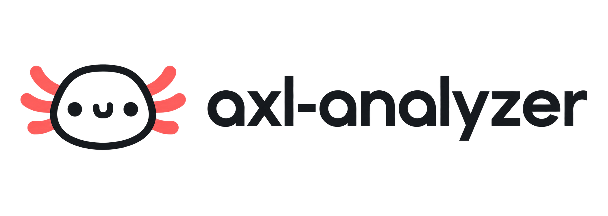

<div align="center">
  
  <br>
  <p>
    
    
    <a href="LICENSE"></a>
  </p>
</div>

  <p><strong>A small, hackable static analyzer for modern Java.</strong></p>
  <p>AST rules for style and metrics, control-flow analysis for deeper checks,<br>and diagnostics made for terminals and CI.</p>


## What is AXL?

AXL is a static-analysis playground that parses Java source code, runs a set of focused rules, and reports findings with precise source locations.

It is intentionally compact, but its internals go beyond simple syntax matching:

- AST-based rules cover naming, size, and complexity checks.
- A control-flow graph (CFG) models branches, loops, `switch`, abrupt exits, `try`/`catch`/`finally`, resources, monitors, and lambdas.
- CFG-based rules can reason about behavior such as unreachable code.
- A reusable forward data-flow solver provides a foundation for future analyses.
- Rules, configuration, problem collection, and reporting are separate, replaceable components.

## Quick start

### Requirements

- JDK 25
- Maven 3.9+

Clone the repository and run the test suite:

```bash
git clone https://github.com/k1ngmang/axl-analyzer.git
cd axl-analyzer
mvn test
```

Analyze a file or an entire source tree:

```bash
mvn -q exec:java \
  -Dexec.mainClass=com.kingmang.axl.Main \
  -Dexec.args="src/main/java"
```

Pass several paths inside `-Dexec.args` to analyze them in one run:

```bash
mvn -q exec:java \
  -Dexec.mainClass=com.kingmang.axl.Main \
  -Dexec.args="module-a/src/main/java module-b/src/main/java"
```

Directories are traversed recursively. At the moment, every regular file below a supplied directory is treated as Java source, regardless of its extension, so point AXL at source-only directories.

### Diagnostic format

Each finding is printed on its own line:

```text
/project/src/Example.java:8:9 [WARNING] unreachable-code: Unreachable code.
```

```text
<file>:<line>:<column> [<severity>] <rule-id>: <message>
```

### Exit codes

| Code | Meaning |
| :--: | --- |
| `0` | Analysis completed with no warnings or errors. Informational findings are allowed. |
| `1` | At least one `WARNING` or `ERROR` was reported. |
| `2` | Invalid CLI input, an invalid path, or an unreadable source was encountered. |

Run the built-in help with:

```bash
mvn -q exec:java \
  -Dexec.mainClass=com.kingmang.axl.Main \
  -Dexec.args="--help"
```

## Built-in rules

All rules are enabled by default.

| Rule ID | Severity | What it checks |
| --- | :---: | --- |
| `class-lines` | INFO / WARNING | Reports classes and interfaces over 300 lines and methods over 30 lines. Warnings begin at 500 and 150 lines respectively. |
| `boolean-name` | INFO | Boolean methods should begin with a question word such as `is`, `has`, `can`, or `should`. |
| `empty-catch-block` | WARNING | Reports a `try` statement that has no `catch` clause. |
| `naming-convention` | WARNING | Class and interface names must be PascalCase; method names must be camelCase; checked names must be longer than two characters. |
| `cyclomatic-complexity` | INFO / WARNING | Reports methods and constructors above complexity 10; warnings begin at 20. |
| `unreachable-code` | WARNING | Uses the CFG to find and group statements that cannot be reached. |
| `parser` | ERROR | Reports syntax errors emitted by JavaParser. |

The complexity score starts at `1` and increases for branches, loops, catches, ternaries, labeled switch entries, and short-circuit `&&` / `||` expressions. Nested classes, lambdas, enums, records, and annotations are excluded from the enclosing declaration's score.


An `AnalysisRunContext` owns the parser, active rules, configuration, and problem collector for one run. Each parsed file gets an `AnalysisContext` containing its source, compilation unit, and lazy CFG repository. This keeps AST-only rules cheap while allowing deeper rules to materialize graphs only when they need them.

The CFG layer exposes normal, conditional, loop-back, return, throw, exception, `finally`, `break`, `continue`, and `yield` edges. Graphs can also be exported to Graphviz DOT with `CfgDotExporter` for debugging.

## Adding a rule

Use `AstRule` when a check can be expressed as a JavaParser visitor:

```java
public final class MyRule extends AstRule {
    @Override
    public void visit(MethodDeclaration method, AnalysisContext context) {
        // Inspect the node and report through collector().
        super.visit(method, context);
    }

    @Override public String getId() { return "my-rule"; }
    @Override public String getDescription() { return "Explains what the rule checks"; }
    @Override public Severity getSeverity() { return Severity.WARNING; }
}
```

Use `CfgRule` when the check depends on execution paths. It receives every executable scope together with its `ControlFlowGraph`. For custom forward analyses, implement `ForwardDataFlowAnalysis<S>` and run it with `ForwardDataFlowSolver`.

Finally, register the rule in the rule list created in `Main` and add focused tests under `src/test/java`.

## Project layout

```text
src/main/java/com/kingmang/axl/
├── cfg/          control-flow graph, DOT export, and data-flow solver
├── core/         parser setup and analysis contexts
├── problem/      diagnostics and severity model
├── report/       output reporters
├── rule/         rule APIs
│   ├── mectrics/ complexity analysis
│   ├── sema/     semantic and CFG-based checks
│   └── style/    naming and source-size checks
└── Main.java     CLI entry point and built-in rule registration
```

## Development

Run all tests:

```bash
mvn test
```

Build the project:

```bash
mvn package
```

The current suite covers the CLI, configuration, diagnostics, AST rules, CFG construction, unreachable-code analysis, complexity calculation, and data-flow convergence.

## License

AXL is available under the [MIT License](LICENSE).
